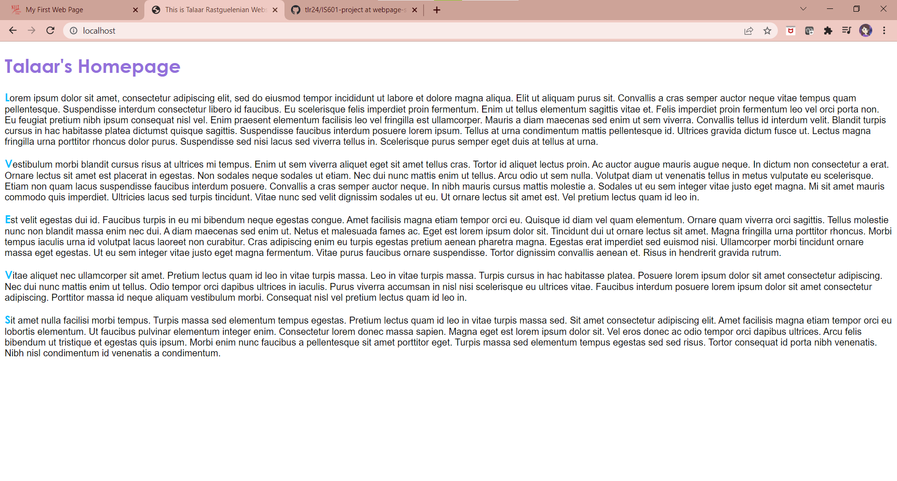
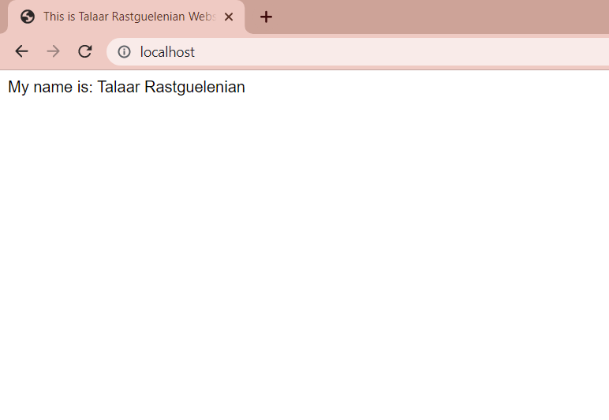

# Docker Nginx Flask Project Setup

Just Run:

docker compose up --build to get it to run and go to locahost to see the site.

## Screenshot of Index Page (Z layout)

## Screenshot of About Page (F layout)

## Screenshot of Web Page

## Screenshot of Running Program

